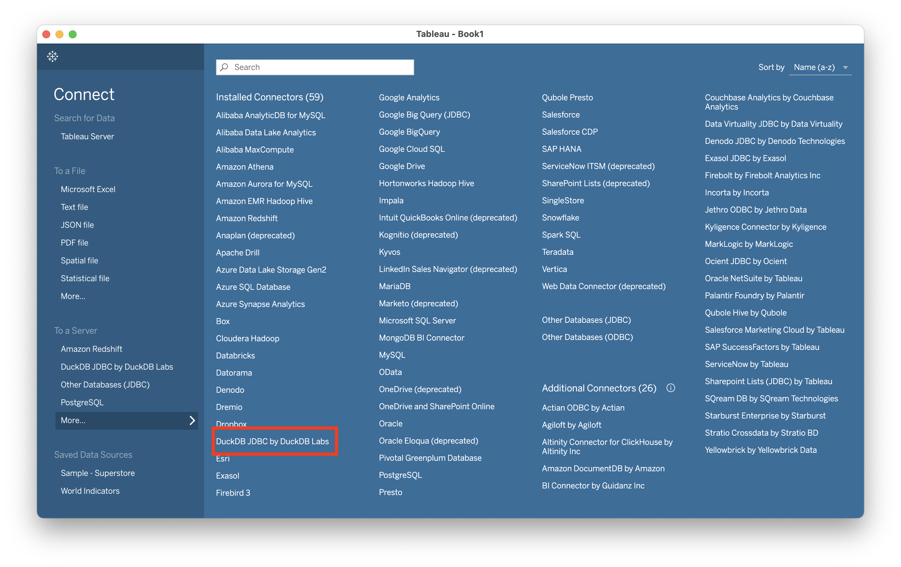
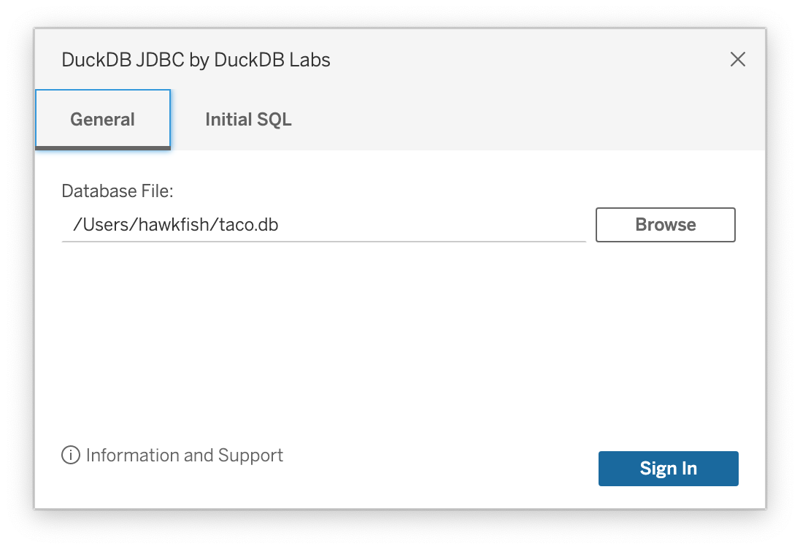
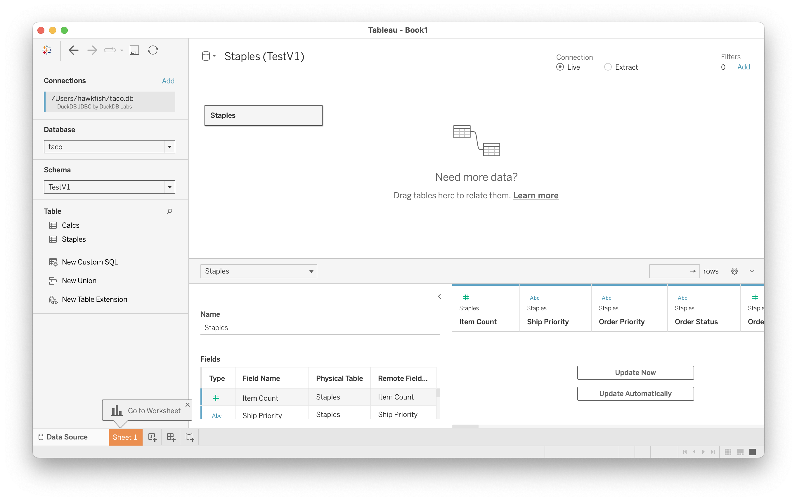
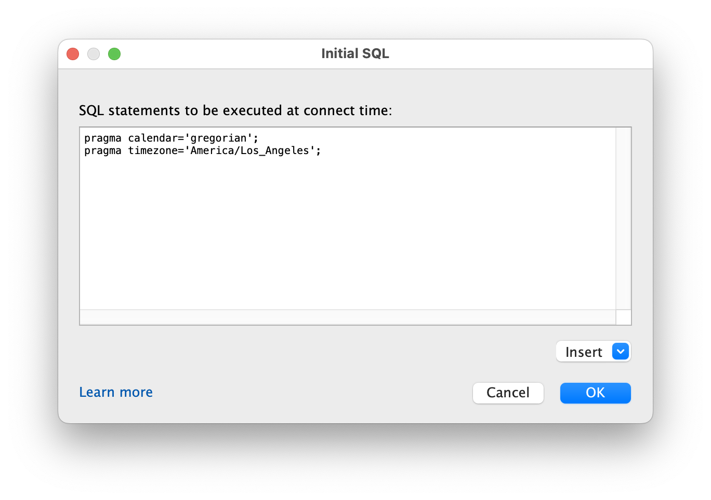

# duckdb-taco
Tableau Connector for DuckDB

## Installation

Adding new drivers to Tableau is a bit tricky, but hopefully these directions should help.

### JDBC Driver

This connector uses the 0.8.0 DuckDB JDBC driver. 
This is partly because the ODBC driver does not seem to work well on MacOS.
Download it and 
[install it in the Tableau Drivers directory](https://tableau.github.io/connector-plugin-sdk/docs/drivers#jdbc-driver-class-isolation).

### Tableau Taco

There are two ways to use a Tableau connector: in development mode and using a signed connector.

To use this connector in development mode, you need to clone (or download) the project to the target machine.
Once you have it, launch Tableau as described in 
[the testing documentation](https://tableau.github.io/connector-plugin-sdk/docs/manual-test#on-tableau-desktop),
Make sure that you point to the `tableau_connectors` subdirectory, not the main project,
as git creates some invisible subdirectories that will abort the loading process.
You can then create a new connection by choosing "DuckDB JDBC by DuckDB Labs":

To use this connector as a signed connector, choose it from the "Additional Connectors" list.
Further information when the connector is approved.

## Connecting

DuckDB is a file-based database, so the connection dialogue simply asks for a file:

Because the engine is embedded in the driver itself, 
you need to make sure that the driver uses the same database version as was used to create the database file.

Once connected, you can use the Tableau connection window to choose schemas, join tables, 
and perform all the basic data cleaning operations it provides for creating a data source:

Note that DuckDB has a three-level naming system (`database.schema.table`)
so you will need to select the schema for the file.

## Initial SQL

Tableau allows connections to run initial SQL.
This feature can be used to make sure that various settings are correct:

## Use Cases

One of the most powerful uses of DuckDB files is not to access data stored in the file, but to query data in other file formats.
To do this, use the database file to store views of the external files.
For example, you can create a `VIEW` of a directory of Hive-partitioned parquet files.
Or, you can use it to perform fast analytics on a SQLite file.
